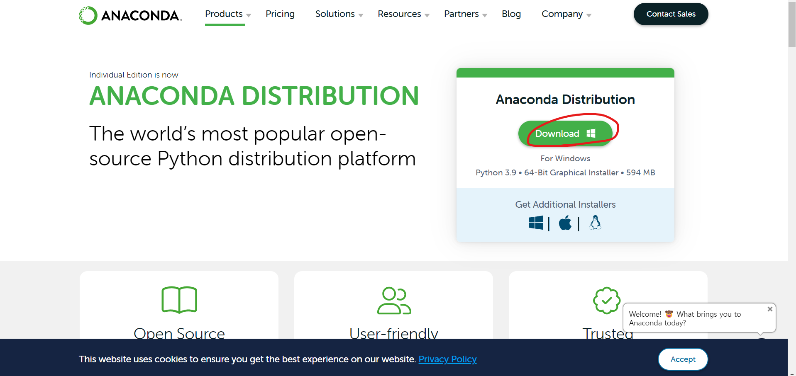
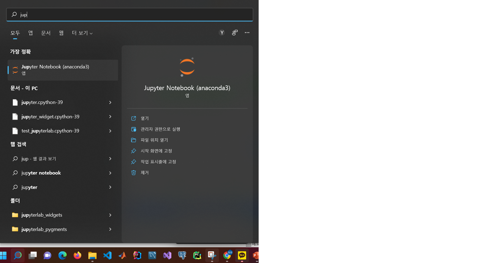

# Pandas_lecture

설치 방법에 대해 알려드리겠습니다.  
우선, pandas및 기타 모듈들을 쉽게 사용하기 위해서는 프레임워크가 필요합니다.  
따라서 파이썬 프레임워크로 많은 분들이 사용하고 계시는 아나콘다를 사용하겠습니다.  

먼저, 아나콘다 공식 사이트인, https://www.anaconda.com/products/distribution 에 방문합니다.   
  
그 후, Anaconda distribution version을 선택하고, 자신의 OS환경에 맞게 프로그램을 다운 받아줍니다.  
실행파일이 설치되면, 기본값(default)을 그대로 두고, 계속 버튼을 눌러 설치를 완료해줍니다.  
설치가 완료되면, 자신의 운영체제에서 Jupyter Notebook(아나콘다)을 검색하여 실행합니다.  
  
  
축하드립니다. 설치가 완료되었습니다.
